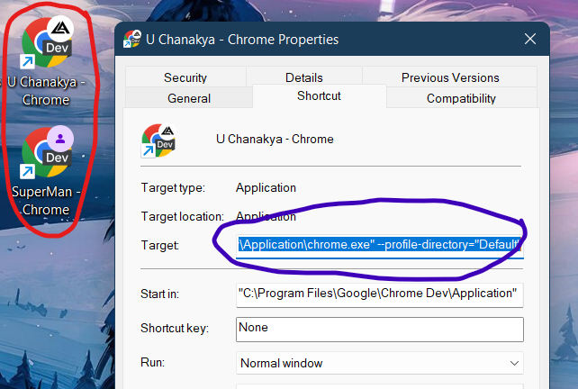
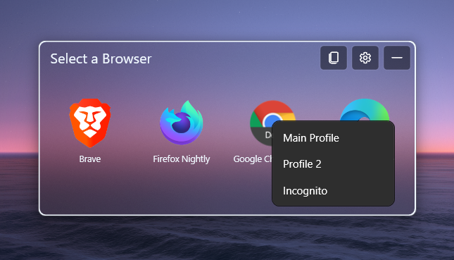

# User settings

When Hurl is lauched for the first time, it automatically detects the installed browsers and creates a _UserSettings.json_ file at `C:\Users\{USER}\AppData\Roaming\Hurl` filling it with browsers it detected. A typical UserSettings.json file looks like this:

```json
{
  "LastUpdated": "22-Feb-22 2:22:22 AM",
  "Version": "0.6.2",
  // "AppSettings: {...},
  "Browsers": [
    {
      "Name": "Brave",
      "ExePath": "C:\\Program Files\\BraveSoftware\\Brave-Browser\\Application\\brave.exe",
      "Hidden": false
    },
    {
      "Name": "Google Chrome Dev",
      "ExePath": "C:\\Program Files\\Google\\Chrome Dev\\Application\\chrome.exe",
      "AlternateLaunches": [
        {
          "ItemName": "Profile 1",
          "LaunchArgs": "--profile-directory=\"Default\""
        },
        {
          "ItemName": "Incognito",
          "LaunchArgs": "-incognito"
        }
      ]
    }
  ]
}
```

## App settings

The following snippet shows the default options:

```json
"AppSettings": {
    "LaunchUnderMouse": false,
    "MinimizeOnFocusLoss": true,
    "NoWhiteBorder": false,
    "BackgroundType": "mica",
    "RuleMatching": false,
    "WindowSize": [460,210]
}
```

### Available options

- `LaunchUnderMouse` default is **false**, can be used to launch the Hurl window under the mouse when enabled
- `MinimizeOnFocusLoss` default is **true**
- `NoWhiteBorder` set **true** or **false** to enable or disable the white border around the window
- `BackgroundType` supports **mica**, **acrylic**, **none**
  - Windows 11 22H2 or above supports all options
  - Windows 11 build 22000 supports only mica
  - Windows 10 is default is **none** irrespective of option
- `RuleMatching` default is **false**. On enabling, it supports the features from [Rulesets](https://github.com/U-C-S/Hurl/wiki/Rulesets)
- `WindowSize` is to store the size of Hurl BrowserSelect window. You dont need to set this, it will be saved automatically when the window is resized.

## Browsers

- `Name` - Displayed name for browser. Required.
- `ExePath` - The path of browser main exe file. Required.
- `CustomIconPath` - The absolute path of the image. Supports URLs. Optional.
- `LaunchArgs` - Add the default exe launch arguments here. Use param `%URL%` injecting the URL at runtime here. Optional.
- `Hidden` - set it to **true** to hide the current icon in the selection screen. Optional.
- `AlternateLaunches` - This is an array; See below. Optional.

### AlternateLaunches

This is a way to launch the browser when you have multiple launch methods or launch targets, like incognito, browser profiles...

Suppose you have multiple chrome profiles like this:



Then you might want to use this feature, instead of totally adding a new browser entity for each profile in the settings file. The following snippet demonstrates this feature.
Adding the `AlternateLaunches` field to the browser entity allows you to simply right-click on the browser icon in the selection window and choose the required option.

```json
"AlternateLaunches": [
  {
    "ItemName": "Main Profile",
    "LaunchArgs": "--profile-directory=\"Default\""
  },
  {
    "ItemName": "Profile 2",
    "LaunchArgs": "--profile-directory=\"Profile 1\""
  },
  {
    "ItemName": "Incognito",
    "LaunchArgs": "-incognito"
  }
]
```

Right-clicking on the browser that has `AlternateLauches` brings up the context menu with options specified as in the settings file. On selecting the the URL will also automatically included while launching the browser.



- `ItemName` - The name that shows up in the context menu for this launch
- `LaunchArgs` - Launch args. You can keep launch the browser in incognito, other browser profiles...
