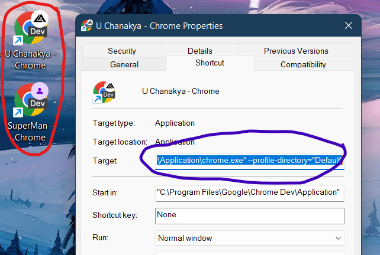
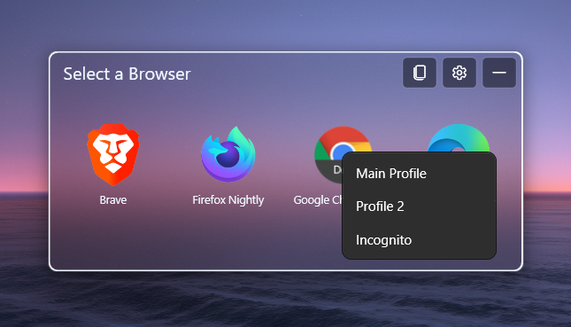

# Browsers

- `Id` - Stable UUID for this browser. Required. Rulesets and Quick View refer to this value.
- `Name` - Displayed name for browser. Required.
- `ExePath` - The path of browser main exe file. Required.
- `CustomIconPath` - The absolute path of the image. Supports URLs. Optional.
- `LaunchArgs` - Add the default exe launch arguments here. Use param `%URL%` injecting the URL at runtime here. Optional.
- `Hidden` - set it to **true** to hide the current icon in the selection screen. Optional.
- `AlternateLaunches` - This is an array; See below. Optional.
- `IsUwp` - set it to **true** if the browser should be launched as UWP app. Required if browser is a UWP app.

## AlternateLaunches

This is a way to launch the browser when you have multiple launch methods or launch targets, like incognito, browser profiles...

Suppose you have multiple chrome profiles like this:



Then you might want to use this feature, instead of totally adding a new browser entity for each profile in the settings file. The following snippet demonstrates this feature.
Adding the `AlternateLaunches` field to the browser entity allows you to simply right-click on the browser icon in the selection window and choose the required option.

```json
"AlternateLaunches": [
  {
    "Id": "f81a1698-1488-461d-9294-4f4f8313178e",
    "ItemName": "Main Profile",
    "LaunchArgs": "--profile-directory=\"Default\""
  },
  {
    "Id": "e9e5df5a-1bc6-4bce-8f8d-e66950daa495",
    "ItemName": "Profile 2",
    "LaunchArgs": "--profile-directory=\"Profile 1\""
  },
  {
    "Id": "4bd80686-0a0b-4668-8ed0-063989e99c14",
    "ItemName": "Incognito",
    "LaunchArgs": "-incognito"
  }
]
```

Right-clicking on the browser that has `AlternateLauches` brings up the context menu with options specified as in the settings file. On selecting the the URL will be automatically included while launching the browser.



- `ItemName` - The name that shows up in the context menu for this launch
- `LaunchArgs` - Launch args. You can keep launch the browser in incognito, other browser profiles...
- `Id` - Stable UUID for this alternate launch. Required when rulesets or Quick View target this profile.

## UWP Browsers

UWP Browsers (Arc etc.), typically installed from Microsoft Store or
msixbundle files, work differently than regular browsers (like regular
Chrome, firefox, edge) and thus also need to be launched differently.

Following config represents two of the UWP browsers. The `ExePath` in
each case is a _family package name_ (TODO: need to clarification on how to
get the package name)

```json
{
  "Id": "2b36a1fe-97f7-4509-ae6e-5c2c61602af4",
  "Name": "Firefox",
  "ExePath": "Mozilla.Firefox_n80bbvh6b1yt2",
  "IsUwp": true,
},
{
  "Id": "e48b823f-c4b0-4218-a7e2-a8c80231228a",
  "Name": "Arc",
  "ExePath": "TheBrowserCompany.Arc_ttt1ap7aakyb4",
  "IsUwp": true,
  "CustomIconPath": "C:\\Program Files\\WindowsApps\\TheBrowserCompany.Arc_1.22.2.55438_x64__ttt1ap7aakyb4\\assets\\DesktopShortcut.ico"
}
```

### Limitations

- Icons aren't fetched since there's no actual executable path involved. You can set a custom icon for now.
- The URL should be a valid URI with protocol, meaning the URL `github.com` won't work like it does for non-UWP browsers, it needs to be `https://github.com`
- Hurl doesn't detect all the installed UWP browsers. have to be manually added.

## Refreshing Browsers list

The new _Hurl Settings_ application supports re-fetching the browsers
list and automatically appends any new ones to the end of the current
list of browsers configured in Hurl.

The browser lookup is based on the `ExePath`. This option checks if
current list doesn't have any browser with same `ExePath` from the
new list of browsers and appends it to end of the list.

### Limitations

- Does not hide/remove the uninstalled browsers
