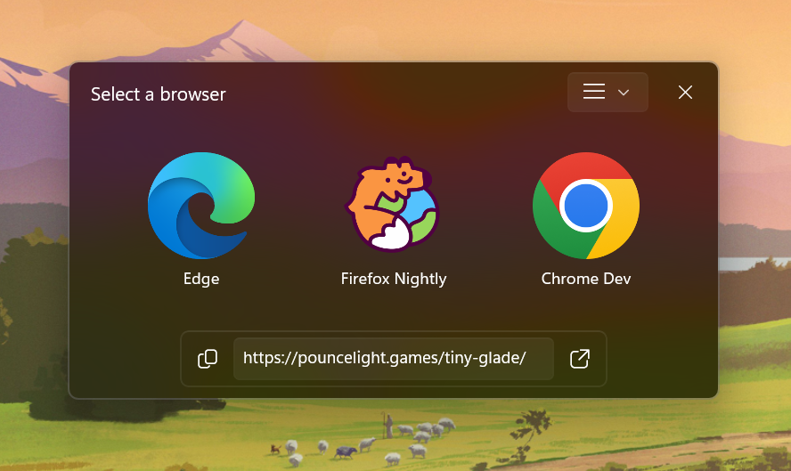

  
  
  <h1>Hurl</h1>
  
  
A windows utility that lets you choose a browser on the click of a link

  
  

    
    
    
    
  

> [!NOTE]
> This software is currently in pre-v1.0 version, which means it can frequently introduce breaking changes with new versions.

## Why and what?

Sometimes you might want to open a link in a browser of your choice, instead of the default one. Hurl lets you choose the browser each time you click a link (links outside of browsers). So naturally, it acts as default browser to do that.

- Modern Windows UI with multiple customization options
- Supports adding custom browser configuration with Launch Arguments
- Rules to automatically open a browser without prompting
- Settings window to manage all the features
- Quickly view URLs by launching them into a WebView2 window or your preferred browser with a shortcut (experimental)
- A Web Extension to open browser tabs in Hurl (experimental)

  

## Installation and usage

Download and install the latest version of [Hurl_Installer](https://github.com/U-C-S/Hurl/releases/latest)

> [!TIP]
> It is recommended to uninstall your current version before installing a new version.

After installing, make sure to set Hurl as the default `http/https` protocol handler aka as the default browser in the Windows Settings. In Windows 11: **Settings** > **Apps** > **Default apps** > **Hurl** > **Set as default browser**.

Vist to [Docs](./Docs/README.md) for more details on usage and configuration.
See [Extensions readme](./Extensions/README.md) for installing the Browser Extension.

## Building from source / local development

- Install [Visual Studio 2026](https://visualstudio.microsoft.com/downloads/) with following workloads:
  - WinUI application development
  - Desktop development with C++ (required for building Launcher)
- After forking and cloning the repository, open the solution file `./Hurl.sln` in Visual Studio. Set **Hurl.App** as the startup project.
- Install [Rustup / Setup Rust complier](https://www.rust-lang.org/tools/install) locally to debug Launcher app
- Install [Inno Setup](https://jrsoftware.org/isdl.php) to create the Hurl Installer

Use the Build Script from `Utils/build.ps1` to build the application in _Release_ mode and build the installer. Make sure you have all the tools installed mentioned in the above description.

To check out older versions source code, go to [Github Tags](https://github.com/U-C-S/Hurl/tags).

## Contributing

This project is open to Pull-Requests and Feedback. MIT License.

## Credits

- Icon used is from [FlatIcons](https://www.flaticon.com/free-icon/internet_4861937)
